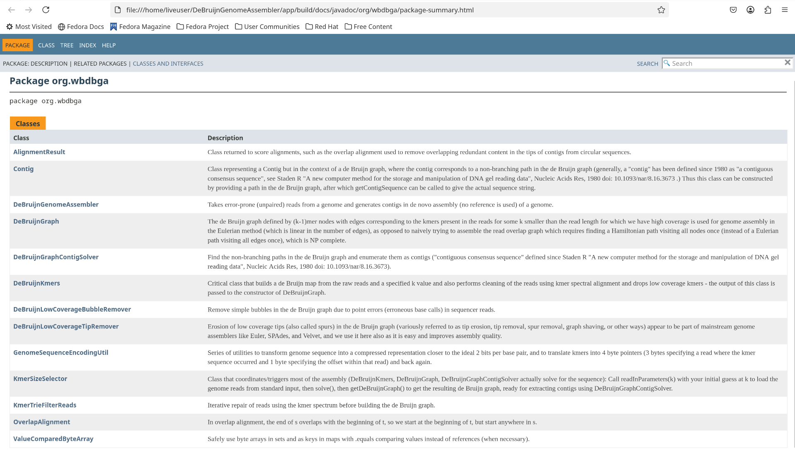
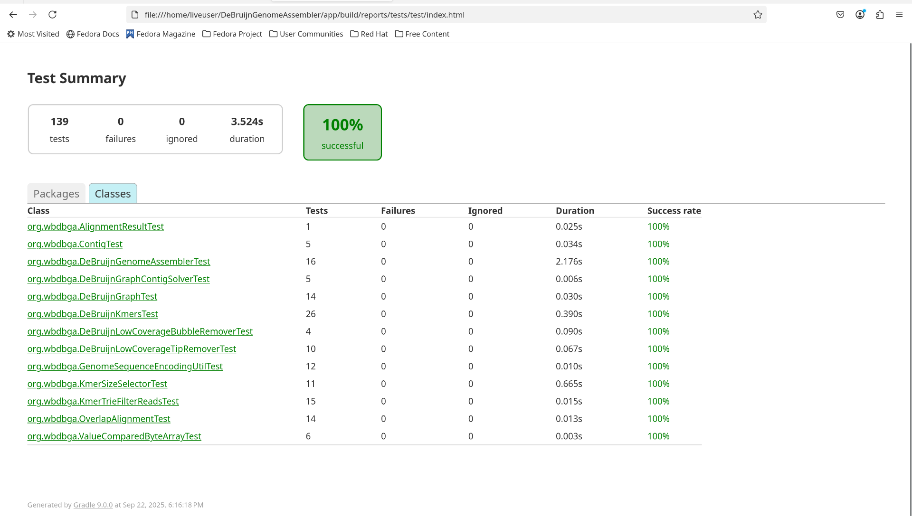
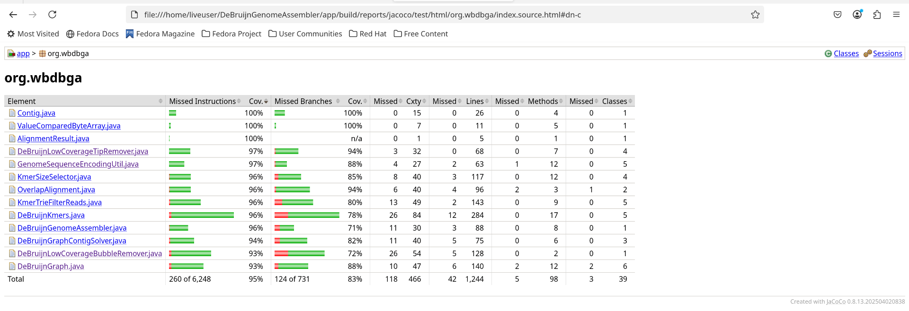

[](https://github.com/willy-b/DeBruijnGenomeAssembler/actions/workflows/gradle.yml)

# About

A de Bruijn Graph based Genome Assembler intended to support assembling error-prone unpaired short reads (~100bp) into genomes up to E. Coli size on relatively cheap laptops.

(Smaller genomes like Carsonella ruddii can be assembled single contig, obviously short-read fragment assemblies are NOT single contig for E. coli or other megabase genomes, see [Table 4 from Ye C, Ma ZS, Cannon CH, et al. 2012](https://bmcbioinformatics.biomedcentral.com/articles/10.1186/1471-2105-13-S6-S1/tables/4) or [Table 1 of Chaisson M, Pevzner P, Tang H 2004](https://academic.oup.com/bioinformatics/article/20/13/2067/242155) or [Whiteford et al. 2005](https://pmc.ncbi.nlm.nih.gov/articles/PMC1278949/) to set expectations based on the literature.)

For background on the approach used here, a good article is "How to apply de Bruijn graphs to genome assembly" by Compeau PE, Pevzner PA, Tesler G at https://pmc.ncbi.nlm.nih.gov/articles/PMC5531759 . Compeau and Pevzner teach the ALGS2xx courses at UC San Diego where I learned the techniques used in this repository. The textbook "Bioinformatics algorithms : an active learning approach, 3rd edition" by Phillip Compeau and Pavel Pevzner (2018) from Active Learning Publishers, available at https://www.bioinformaticsalgorithms.org/ is also an excellent resource.

**This repository is NOT for any competition or commercial purpose, it is just for practicing algorithms and data structures as well as bioinformatics.**

**Status: This project is under development.** While this project is already functional and readers can try assembling reads with known reference genomes and checking against the reference using [QUAST](https://quast.sourceforge.net/) or try for de novo assembly, it is not recommended to use anything derived from this project for anything sensitive/critical/important unless you are an expert who can modify and verify the result is satisfactory for your use case.

No AI assistance was used in the planning, research for, development of, or review of this project.

# Running

First, make sure the [the included gradlew wrapper works on your machine or gradle build tool is otherwise installed](https://docs.gradle.org/current/userguide/installation.html) (using any form of gradle is not strictly necessary for this program but gradle integration makes it easy to run automated tests and checks, e.g. in GitHub after every change using the Gradle Github Action.)

For a simple runnable example, downloading a genome, generating fake sequencer reads from it, then reassembling those, 

from the DeBruijnGenomeAssembler folder, run:
```
# switch to utility folder to generate fake data
cd util

# download the genome to generate the fake sequencer reads from 
# and that we can grade ourselves against at the end using QUAST
wget 'https://www.ncbi.nlm.nih.gov/sviewer/viewer.cgi?tool=portal&save=file&log$=seqview&db=nuccore&report=fasta&id=116235183&extrafeat=null&conwithfeat=on&hide-cdd=on' -O carsonella_ruddii_complete_genome_AP009180.1.fasta

# generate the fake sequencer reads
javac GenerateNoisyReadsFromWholeGenomeFasta.java
java GenerateNoisyReadsFromWholeGenomeFasta --input_fasta carsonella_ruddii_complete_genome_AP009180.1.fasta --error_probability 0.01 --read_length 100 --read_coverage 30 --random_seed 1 > ../examples/noisyCarsonellaRuddiiReads.txt

# go back to the DeBruijnGenomeAssembler folder
cd ../

# run the assembler
./gradlew build # or `gradle build` if a compatible gradle is already installed
java -jar ./app/build/libs/app.jar < examples/noisyCarsonellaRuddiiReads.txt
```
To see the Carsonella ruddii genome assembled without errors into a single contig starting from 100bp reads with 1% random errors and approximately 30x read coverage.
The assembly will be printed out and also saved in `output.fasta` (or a file of your choosing can be specified using the `--output_fasta` commandline argument). ([See how to assess the quality of the assembly using QUAST in the examples README](examples/README.md#run-quast-to-check-our-assembly-quality-against-the-reference)).

(Note the challenge problem on p164 of Compeau, P. E., Pevzner, P. A. (2018). Bioinformatics algorithms : an active learning approach, 3rd ed. Active Learning Publishers. https://www.bioinformaticsalgorithms.org/ suggests that even with error free reads, using unpaired reads for de Bruijn graph assembly of Carsonella ruddii (only 159662bp) will fail and paired will be required but we can get a perfect assembly in the 1st contig above using unpaired noisy reads.)

More generally, for some data.txt where `data.txt` contains 1 error-prone read per line (string of ATCG genetic sequence, consistent length, ideally divisible by 4), and optionally a first line giving the number of reads, you can run:
```
./gradlew build # or `gradle build` if a compatible gradle is already installed
java -jar ./app/build/libs/app.jar < data.txt
```
E.g. data.txt could be a text file with first line `1000` and then 1000 lines of 100 ATCG genetic sequence characters each. If there are more lines in the file than specified on the first line, only up to that number of reads will be read before stopping.

If you find yourself hitting the memory limits for larger genomes and/or want to compare settings, you might try adjusting some JVM flags and running wrapped in `time`:
```
./gradlew build # or `gradle build` if a compatible gradle is already installed
time java -verbosegc -XX:-UseGCOverheadLimit -Xmx4096M -Xms4096M -XX:+UseSerialGC -jar ./app/build/libs/app.jar < data.txt
```

Where if you have more memory, you can increase the `-Xmx`/`-Xms`, e.g. for 16Gb of RAM, allocating 12,288M of it (8192 + 4096) via `-Xmx12288M -Xms12288M` is advised (computer should remain usable during assembly but will be slow).

For more detailed examples using this assembler see the  page.

# Documentation

Java documentation can be generated using `gradle javadoc`, and will then be available in the subfolder `app/build/docs/javadoc/` ,
with the package summary page at `app/build/docs/javadoc/org/wbdbga/package-summary.html` (should be able to navigate to it and open it with your web browser of choice and then follow links to learn about each part of this project from there).

E.g.


# Unit tests (Gradle and JUnit) with reported unit test code coverage (JaCoCo)

After running `./gradlew clean build` the unit tests should automatically run and unit test coverage should also be automatically analyzed and reported.

There will be a HTML unit test report generated by [Gradle](https://gradle.org/)/[JUnit](https://junit.org) available after running `./gradlew clean build` (or `gradle clean build` if compatible gradle is already installed)

at `./app/build/reports/tests/test/index.html`:



And a unit test coverage report via the [JaCoCo tool](https://www.jacoco.org/jacoco/index.html) ([via Gradle integration](https://docs.gradle.org/current/userguide/jacoco_plugin.html)) showing how much of the code is covered/activated by the unit tests should be available after doing a build

at `./app/build/reports/jacoco/test/html/index.html`:



In this project we require all unit tests to be passing and target a minimum of 95% unit test line coverage for PRs. Passing unit tests are enforced by Gradle in GitHub actions at this time.

# Related reading

Papers/books describing the approach used here:

- Pevzner, P. A., Tang, H., & Waterman, M. S. (2001). An Eulerian path approach to DNA fragment assembly. Proceedings of the national academy of sciences, 98(17), 9748-9753. https://doi.org/10.1073/pnas.171285098 .
- Compeau, P. E., Pevzner, P. A., & Tesler, G. (2011). How to apply de Bruijn graphs to genome assembly. Nature biotechnology, 29(11), 987-991. https://pmc.ncbi.nlm.nih.gov/articles/PMC5531759 .
- Compeau, P. E., Pevzner, P. A. (2018). Bioinformatics algorithms : an active learning approach, 3rd ed. Active Learning Publishers. https://www.bioinformaticsalgorithms.org/ .

Papers setting expectations on what type of assemblies should be expected to be feasible using short reads:

- Whiteford, N., Haslam, N., Weber, G., Prügel-Bennett, A., Essex, J. W., Roach, P. L., Bradley M., Neylon, C. (2005). An analysis of the feasibility of short read sequencing. Nucleic acids research, 33(19), e171-e171.  https://pmc.ncbi.nlm.nih.gov/articles/PMC1278949/

- Chaisson, M., Pevzner, P., & Tang, H. (2004). Fragment assembly with short reads. Bioinformatics, 20(13), 2067-2074. https://academic.oup.com/bioinformatics/article/20/13/2067/242155
Especially Table 1 for setting expectations on contigs, showing they require over 750nt read length before <100 contigs are required to cover megabase bacterial genomes.

A review paper on assembly algorithms discussing de Bruijn graph approaches like EULER and Velvet:

- Miller, J. R., Koren, S., & Sutton, G. (2010). Assembly algorithms for next-generation sequencing data. Genomics, 95(6), 315-327. https://www.sciencedirect.com/science/article/pii/S0888754310000492 

SparseAssembler is an assembler pushing the low-memory limits for assembly and they also have a good comparison of assemblers on E. coli in their Table 4:

- Ye, C., Ma, Z. S., Cannon, C. H., Pop, M., & Yu, D. W. (2012). Exploiting sparseness in de novo genome assembly. BMC bioinformatics, 13(Suppl 6), S1. https://bmcbioinformatics.biomedcentral.com/articles/10.1186/1471-2105-13-S6-S1 ,

**see in particular their table 4 comparing assemblers on E. coli Illumina sequencer short reads**: https://bmcbioinformatics.biomedcentral.com/articles/10.1186/1471-2105-13-S6-S1/tables/4

And a very recent review of latest (2024) sequencers and assembly methods including the unbelievably (up to megabase) long reads (very error prone though) now available:

- Espinosa, E., Bautista, R., Larrosa, R., & Plata, O. (2024). Advancements in long-read genome sequencing technologies and algorithms. Genomics, 116(3), 110842. https://www.sciencedirect.com/science/article/pii/S0888754324000636

### License

Copyright (C) 2025 William Bruns

This documentation comes with ABSOLUTELY NO WARRANTY and is provided "AS IS".
This is distributed in the hope that it will be useful,
but WITHOUT ANY WARRANTY; without even the implied warranty of
MERCHANTABILITY or FITNESS FOR A PARTICULAR PURPOSE.

See [the full license](LICENSE) .

The license used is usually indicated in each file in the project, but
[the GPLv3 license](LICENSE) generally applies EXCEPT to genome sequences
(as in examples/*.txt or util/*.fasta or example outputs) 
which have their sources noted elsewhere and come from government data repositories 
(and noting that actual organism DNA sequences are not copyrightable by anyone in the US),
and EXCEPT gradle build tool related build scripts 
which indicate their own copyright and licensing at the top.
